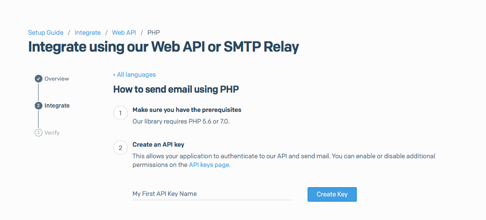
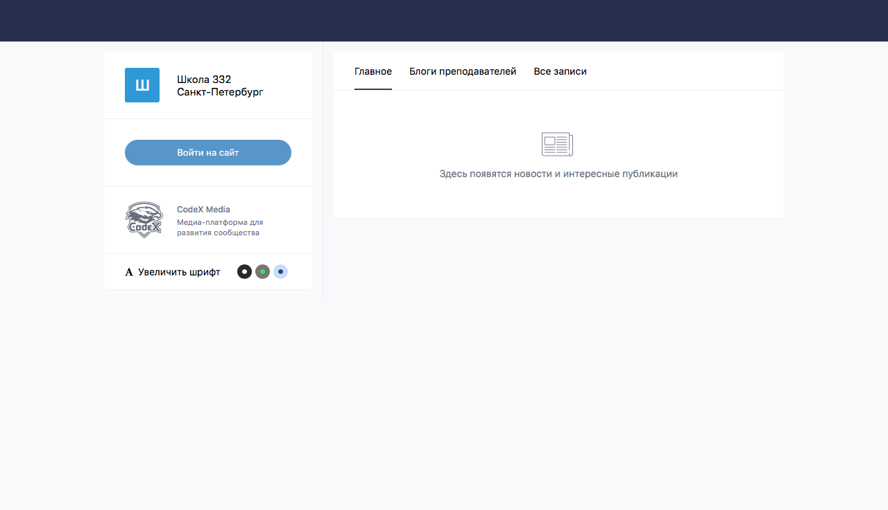

# Development Guide

Here are a few steps to run your local CodeX Media.

Make sure that you have installed [Docker](https://docs.docker.com/install/) and [docker-compose](https://docs.docker.com/compose/).

## 1. Clone this repository with submodules

```shell
git clone https://github.com/codex-team/codex.media
cd codex.media
```

## 2. In the repository's root build and run Docker containers.

```shell
docker-compose build
docker-compose up
```

## 3. Run composer in PHP container and install all dependencies.

```shell
docker exec -i codexmedia_php_1 composer install
```

## 4. Create `.env` config file in a subfolder `www` and fill up params.

You can copy env file skeleton from sample file `codex.media/www/.env.sample`.

```shell
cd www
cp .env.sample .env
```

This site uses [Hawk](https://hawk.so) as error catching service. You can create an account and add a new project.

## 5. Now you need to set up directories for uploaded files, cache and logs. They will be placed here:

```
codex.media (project's root directory)
  |- docker
  |- docs
  |- www ( <- You are here )
  |   |- application
  |   |   |- cache
  |   |   |- logs
  |   |   ...
  |   ...
  |   |- upload
  |   ...
  ...
```

Create a directory for uploaded files e.g. editor's images and users' profile pictures.

```shell
mkdir upload
chmod 777 upload
```

Then you need to go to the `application` directory. Create these two directories and set full access permissions for every user.

```shell
cd application
mkdir cache logs
chmod 777 cache logs
```

## 6. Create a MySQL database.

Open phpMyAdmin in [localhost:8091](http://localhost:8091).

Use these credentials to sign in.

- server: `mysql`
- login: `root`
- password: `root`

Create a new database with the name, say, `codex-media` with `utf8_general_ci` collation.

Open `IMPORT` tab and choose `!_codexdb.sql` file to import. In this file you can find SQL-requests to make a complete database skeleton.

```
codex.media
  |- www
  |   |- migrations
  |   |   |- !_codex-media.sql
  |   |   ...
  |   ...
  ...
```

## 7. The last step is setting up config files.

Go to `codex.media/www/application/config` and duplicate sample files without `.sample` in their names.

### redis.php

Set `redis` as a hostname, to match the hostname of the docker container with Redis.
Other fields you can left with default values.

### cache.php

On 10th line in `host` param you should set Memcached container's hostname `memcached`.

```
'host'             => 'memcached',  // Memcache Server
```

### database.php

Set `mysql` as a hostname of MySQL container. Type database name, username and password.

```
'hostname'   => 'mysql',
'database'   => 'codex-media',
'username'   => 'root',
'password'   => 'root',
```

### email.php

CodeX Media uses a [Sendgrid](https://sendgrid.com) as a mailing service.

1. Register a new account and choose free plan (40000 emails per month)

2. Open [Setup Guide - Integrate - Web API - PHP](https://app.sendgrid.com/guide/integrate/langs/php)



Enter a name for a new key then press «Create Key»


Copy this key and paste to `email.php` config file.

You can fill up `senderName` and `senderEmail`.

### social.php


To enable authorisation via Twitter on your local site you need to create a new GitHub OAuth app.

Open [https://github.com/settings/applications/new](https://github.com/settings/applications/new) and fill the form.

Set any `Application name` and enter a correct link (with protocol) to your site as a `Homepage URL`.

In the field `Authorization callback URL` you should type a link to your local site with `/auth/github` uri:

```
http://localhost:8080/auth/github
```


After registering an application you will be redirected to app's settings page. Get there `Client ID` and `Client Secret` params and put then into the `APP_ID` and `APP_SECRET` fields in `oauth.php` on lines 30 and 31.

```
...
'github' => array(
    'APP_ID'        => '',
    'APP_SECRET'    => '',
...    
```
### communities.php (optional feature)

If you want to enable auto posting news to VK community page, then follow [this guide](https://github.com/codex-team/codex.edu/issues/119#issuecomment-296349880). You need to have rights to post anything to the community's wall as that community.

Shortly you need to register a new Standalone application, give it rights to post to walls from your name and get an `access_token`. Then you need to get `group_id` — a page's identifier (integer number below zero).

Then you'll be able to enable or disable posting news to community's wall.


### telegram-notification.php (optional feature)

Somewhere in the project we use notifications from [@codex_bot](https://ifmo.su/bot). You can get a notifications link from it typing a command `/notify_start`. You have to add [@codex_bot](https://t.me/codex_bot) in Telegram for that and start conversation.

## 8. Open [http://localhost:8090](http://localhost:8090). You'll see a CodeX Media's homepage.

 

## 9. If you want to be a superuser, you should give yourself an admin status.

In phpMyAdmin choose database for this site (codex-media) and open table `Users`. Find row with for your user and change `role` value from `1` to `3`.

Changes will be applied in 5 minutes because we use caching to reduce the database load. You can also clear cache yourself by restarting Memcached container.

```
docker restart codexmedia_memcached_1
```
